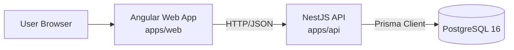

# Architecture

## Purpose

This document describes the current architecture of the AI Marketing Platform and acts as the baseline for future architectural decisions.

## System Overview

The platform is a monorepo with:

- `apps/web`: Angular 21 frontend application
- `apps/api`: NestJS 11 backend API
- PostgreSQL 16 as primary relational database
- Prisma ORM in the API layer
- Turborepo for task orchestration across apps/packages

## High-Level Diagram



## Container and Runtime View

### Frontend (`apps/web`)

- Angular 21 application serving the UI.
- Responsible for routing, form flows, and user-facing state.
- Communicates with backend through HTTP APIs.

### Backend (`apps/api`)

- NestJS 11 service exposing application APIs.
- Handles validation, business logic, and integration boundaries.
- Owns database access via Prisma.

### Database (`postgres`)

- PostgreSQL 16 container defined in `docker-compose.yml`.
- Single source of persisted relational data.

## Source Layout

```text
.
├── apps/
│   ├── api/        # NestJS backend
│   └── web/        # Angular frontend
├── packages/
│   ├── eslint-config/
│   └── typescript-config/
├── docs/
│   ├── README.md
│   └── architecture.md
├── turbo.json
└── docker-compose.yml
```

## Request Flow

1. User interacts with Angular UI in `apps/web`.
2. Frontend sends HTTP request to NestJS API in `apps/api`.
3. API validates input and executes business use case.
4. API reads/writes data through Prisma into PostgreSQL.
5. API returns JSON response.
6. Frontend updates UI state and renders result.

## Build and Local Development Architecture

- Workspace uses `pnpm` and `turbo` from repository root.
- Root `dev` runs dev tasks for active apps.
- `apps/web` is served by Angular dev server (default port `4200` in app script).
- `apps/api` runs NestJS in watch mode.
- `docker-compose.yml` provides local PostgreSQL and API containerized path.

## Cross-Cutting Concerns (Current + Target)

### Validation and Error Handling

- **Current direction:** validate at API boundaries and map failures to explicit HTTP responses.
- **Target standard:** consistent error envelope and explicit domain/infrastructure error classes.

### Security

- **Current assumption:** API is the only write path to the database.
- **Target standard:** formal auth/authz model and documented secret management.

### Observability

- **Current:** basic service logging.
- **Target:** structured logs, request tracing, and endpoint-level metrics.

### Testing

- Frontend: unit/integration tests for changed UI behavior.
- Backend: unit tests for services and e2e tests for critical endpoints.

## Known Gaps / To Be Documented

- API contract documentation (endpoints, payloads, errors)
- Domain model and bounded contexts
- Deployment architecture (staging/production)
- CI/CD and release process
- Authentication and authorization flows

## Change Management

When architecture changes:

1. Update this file in the same PR.
2. Add or update related docs in `docs/`.
3. If decision has trade-offs, add an ADR-style note (future `docs/adr/`).
